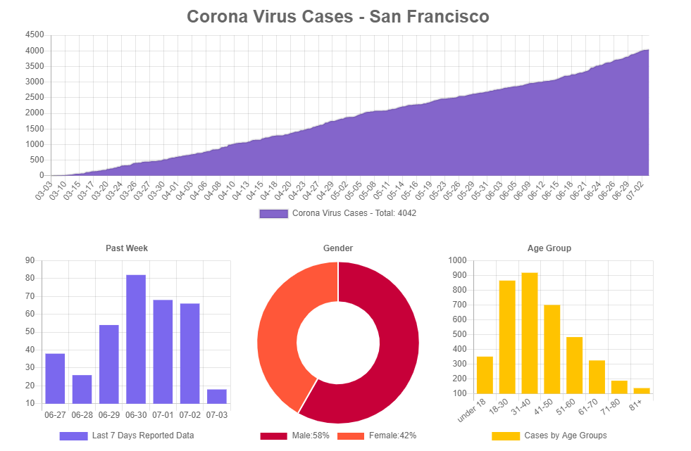
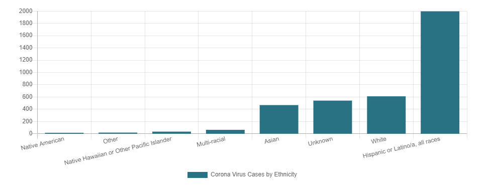

# ChartJs and Covid19 Project





This project uses React and ChartJs to create a dashboard about current Coronavirus data in San Francisco. The app pulls the data from an API and maps the data into a usable format for ChartJs.

To run this project locally just type:
```
npm install
```
Then open the index.html file in a browser.
